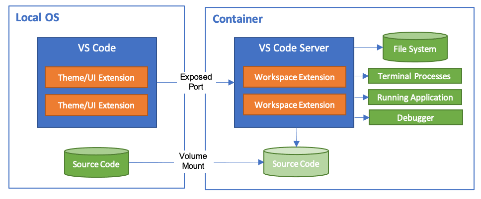

# Shenzhen_innoX_2024wc_ws

## 更新说明

镜像仓库地址：https://hub.docker.com/repository/docker/wzx1210/innox2024_wc

| 时间 | tag | 说明 |
| --------- | ------ | ------------------------------------------------------------------------- |
| 2024.1.17 | v1.0.1 | 更新镜像支持可视化展示、支持"/dev/robomaster"（未测试）、支持"/dev/video"（未测试）|
| 2024.1.18 | v1.0.2 | 安装缺少库，支持摄像头 |
| 2024.1.24 | v1.0.3 | 安装putty等串口调试工具，验证所有硬件支持 |
| 2024.1.24 | v1.0.4 | 安装串口库 |
| 2024.1.25 | v1.0.5 | 配置ekf包系统环境 |
| 2024.1.24 | wzx1210/innox2024_wc:v2.0.0 | 【弃用】基础镜像：arm64v8/ubuntu:focal |
| 2024.1.24 | wzx1210/innox2024_wc:v2.0.1 | 【弃用】更换系统源，安装ros，安装python并换源，修改系统时区，安装git、vim，putty等常用工具 |
| 2024.1.24 | wzx1210/innox2024_wc:v2.0.2 | 【弃用】配置工作空间环境 |
| 2024.1.24 | wzx1210/innox2024_wc:v2.0.3 | 【弃用】支持可视化 |
| 2024.1.26 | registry.cn-hangzhou.aliyuncs.com/wzx1210/innox2024_wc:v3.0.0 |  ros基础镜像|
| 2024.1.26 | registry.cn-hangzhou.aliyuncs.com/wzx1210/innox2024_wc:v3.0.1 |  更新配置
| 2024.1.28 | registry.cn-hangzhou.aliyuncs.com/wzx1210/innox2024_wc:v3.0.3 |  添加键鼠控制包、v4l-utils

## 环境说明

- Docker-Image: wzx1210/innox2024_wc:v1.0.1
- Ubuntu 20.04
- Ros Neotic 
- Mamba
- vscode-plugin: cmake / ros / c++ / python
- docker-network-mode: bridge

## 环境测试

|          | Linux | Windows                     | PI | Macos |
| -------- | ----- | --------------------------- | -- | ----- |
| 测试镜像 | wzx1210/innox2024_wc:v1.0.2      | wzx1210/innox2024_wc:v1.0.1 | registry.cn-hangzhou.aliyuncs.com/wzx1210/innox2024_wc:v3.0.1   |       |
| 可以启动 | √    | √                          |   √  |       |
| 可视化   | √     | √                          |  √   |       |
| 硬件通讯（USB_CAM） | √     | ×                          |  √   |       |
| 硬件通讯（下位机） |  √      |                           |  √   |       |

## Workflow

如果你有兴趣可以阅读以下内容，也可以直接跳过

1. 使用devcontainer作为开发环境。 https://containers.dev/
2. devcontainer的一个特征是将代码的运行环境与代码本身完全隔离开来，在效果上类似将workspace挂载到了容器中。
3. 在docker-image中仅仅包含有关系统的配置（例如修改baserc或安装依赖包等），其本身不存储任何项目代码和工作空间，做到了代码与环境的完全隔离
4. 可以通过devcontainer.json配置文件，快速修改和分发容器配置。
5. 与vscode深度融合，一键启动，无需任何命令

## 功能包框架

2024 高中生冬令营捕鱼机器人由底盘，机械臂构成，算法组主要负责底盘部分，进行 Apriltag 识别、定位导航、颜色块的识别与抓取，基础功能包由以下构成

**apriltags2** 
tag 编码，录入新 tag

**apriltags2_ros** 
处理图片，发布 tag 信息；设置 tag 尺寸、ID

**camera_calibration**
摄像头标定功能包

**map_sever**
地图发布节点，发布比赛地图信息

**mavlink2ros**
实现 ROS 与 Robomaster C 型开发板进行数据交互，通过 micro USB 连接，传输双方设定好的数据包
目前实现接收并计算底盘轮式里程计数据，并发布 `/odom` 话题；接收 `/cmd_vel` 话题，控制底盘移动

**odom_calib** 
接收 tag 识别结果，更新 map 与 odom 的 tf 变换 map2odom_transform；发布货物相对底盘位姿 base2item_pose

**rmep_bringup** 
启动 launch 文件；发布静态 tf 变换（base_link -> cam）；实现规则主要逻辑

**serial**
提供了一个面向对象的 C++ 接口，用于在计算机上使用串行端口

**simple_planner** 
订阅 rviz 相关话题，进行路径规划与速度发布；包含路径规划和定点导航、PID 对位控制

**static_transform**
静态 tf 发布节点（tag -> map），由 map_sever 调用

**usb_cam**
USB 摄像头功能包

## 使用教程

详见：[使用教程](/使用教程.md)